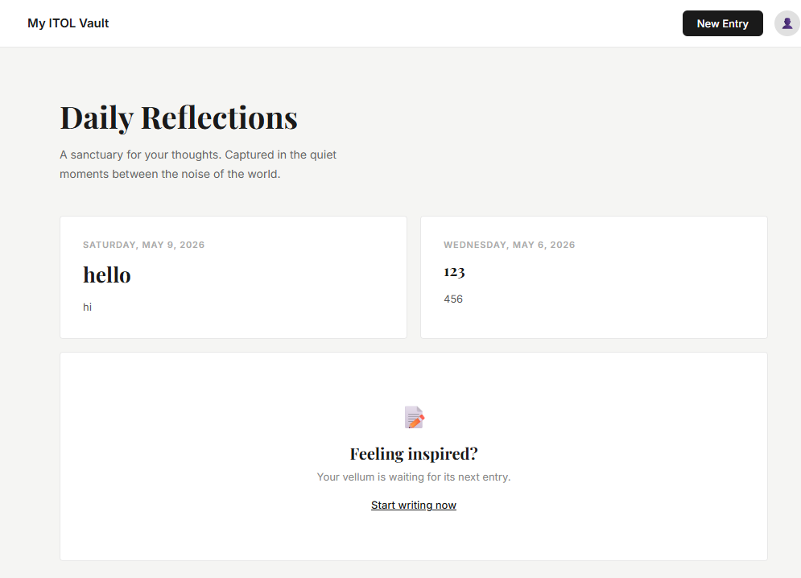
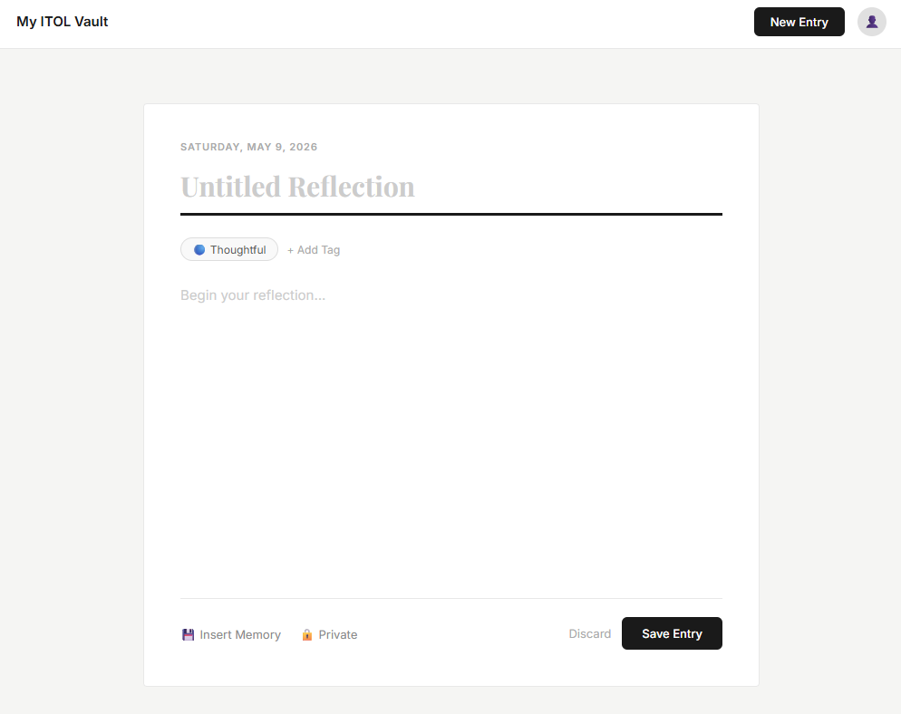
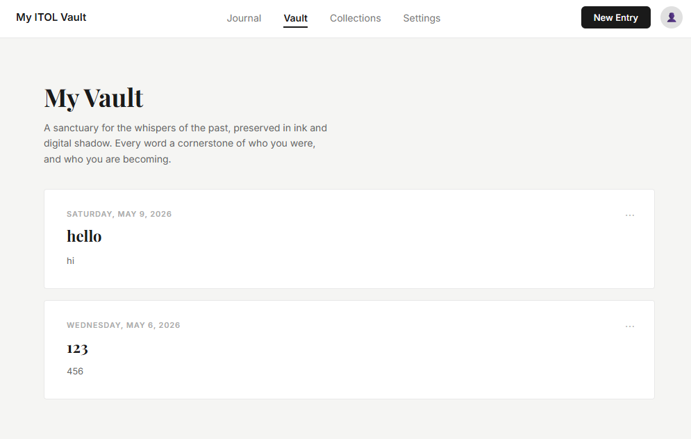

# My ITOL Vault

A digital diary I built as part of my ITOL JavaScript project. You can write daily reflections, save them, and browse back through everything you've written. All the data is stored in the browser so nothing gets lost when you close the tab.

---

## Screenshots

**Home Page**


**New Entry**


**Vault**


---

## How the 5 Most Recent Entries Logic Works

Every time you save an entry it gets pushed into an array and stored in localStorage as a JSON string. When the home page loads, I pull that string out, parse it back into an array, and then reverse it so the newest entries come first.

From there I just use `.slice(0, 5)` to cut it down to 5 and loop through them to build the cards.

```js
var newestFirst = entriesArray.slice().reverse();
var recentEntries = newestFirst.slice(0, 5);
```

I used `.slice()` before `.reverse()` so it makes a copy of the array first — otherwise `.reverse()` would change the original which could cause issues elsewhere.

---

## localStorage

I used localStorage to keep the entries saved across all three pages. It was something new for me on this project — the main thing I learned is that it only stores strings, so you have to use `JSON.stringify()` when saving and `JSON.parse()` when reading it back.

MDN Docs: https://developer.mozilla.org/en-US/docs/Web/API/Window/localStorage

---

## Pages

- `index.html` — home page, shows your 5 most recent entries
- `new-entry.html` — where you write and save a new entry
- `vault.html` — shows every entry you've ever written

## Built With

- HTML
- CSS
- JavaScript
- localStorage
